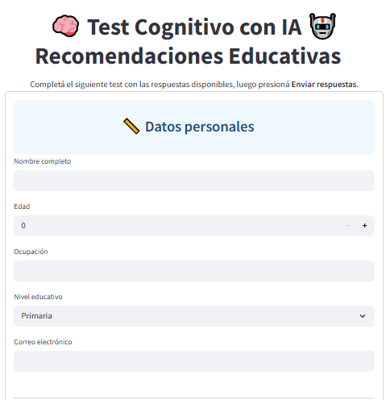

# 🧠 NeuroTest

**NeuroTest: Evaluación Cognitiva con IA** es una herramienta interactiva que combina tests personalizados, clasificación automática mediante aprendizaje automático y recomendaciones educativas adaptadas al perfil del usuario. Este MVP modular y escalable fue desarrollado en Python utilizando **Streamlit** como interfaz, integrando análisis de resultados, generación de reportes, retroalimentación de usuarios y carga automatizada en Google Sheets mediante API.

---

## 🎯 Objetivo del Proyecto

- Evaluar habilidades cognitivas en las áreas de **memoria**, **atención**, **lenguaje** y **razonamiento lógico** mediante un test interactivo.
- Clasificar automáticamente el nivel de riesgo cognitivo en cada área (**Sin riesgo, Leve, Moderado, Alto**) utilizando un modelo de **Machine Learning (Random Forest).**
- Generar **recomendaciones personalizadas** para estimular las áreas evaluadas, integrando una API de búsqueda automática con **Google Search**.
- Ofrecer funcionalidades de valor agregado: 
  - Visualización de resultados con gráficos.
  - Exportación en **PDF**.
  - Calificación del sistema mediante estrellas (1 a 5).
  - Almacenamiento automático de resultados y feedback en **Google Sheets**.

---

## 🧠 Arquitectura del Sistema

| Módulo               | Funcionalidad Principal |
|----------------------|-------------------------|
| `test_data.py`       | Preguntas y pesos para el test cognitivo. |
| `interaccion.py`     | Evaluación de respuestas y asignación de puntajes. |
| `classifier.py`      | Clasificación de nivel de riesgo por área con Random Forest. |
| `google_search.py`   | Recomendación de recursos educativos usando búsqueda con Google Search API. |
| `visualizacion.py`   | Gráfico polar de desempeño cognitivo por área. |
| `html_generator.py`  | Generación de HTML con los resultados del test. |
| `export_pdf.py`      | Exportación del informe en formato PDF. |
| `sheets.py`          | Carga automática de resultados y calificaciones en Google Sheets. |

---

## ⚙️ Funcionamiento

1. **Inicio**: El usuario responde un test interactivo con 20 preguntas.
2. **Evaluación**: Cada respuesta tiene un valor asociado, que se suma por área cognitiva.
3. **Clasificación**: Un modelo entrenado con Random Forest predice el nivel de riesgo por área (ej. “Memoria: riesgo leve”).
4. **Recomendación**: Se consulta la API de Google Search para obtener recursos relevantes que ayuden a fortalecer las áreas con déficit.
5. **Visualización**: Se muestran los resultados en gráficos radiales y un resumen textual del perfil.
6. **Exportación**: El usuario puede generar un PDF con el resumen.
7. **Feedback**: El usuario califica la utilidad del sistema (1 a 5 estrellas).
8. **Almacenamiento**: Todos los datos se almacenan automáticamente en una hoja de cálculo de Google Sheets.

---

## 🧪 Tecnologías Utilizadas

| Tecnología           | Uso Principal                                   |
|----------------------|--------------------------------------------------|
| Python 3.10+         | Lenguaje base del proyecto                       |
| Streamlit            | Desarrollo de interfaz gráfica interactiva       |
| Scikit-learn         | Modelo de Machine Learning (Random Forest)       |
| Google Search API    | Recomendación de recursos personalizados         |
| Pandas / NumPy       | Análisis y manipulación de datos                 |
| Matplotlib           | Visualización de resultados                      |
| Google Sheets API    | Almacenamiento de resultados y feedback          |
| WeasyPrint / PDFKit  | Exportación de reportes en PDF                   |

---

## 📂 Estructura del Proyecto

```

CognitiveEvaluatorSystem/
├── app.py / main.py  # Inicio de la aplicación en Streamlit
├── model/
│   └── classifier.py  # Entrenamiento y predicción con Random Forest
├── data/
│   └── generator.py  # Generación de dataset para entrenamiento con datos anónimos
├── utils/
│   ├── test_data.py        # Preguntas del test y sus pesos
│   ├── interaccion.py      # Evaluación y clasificación de respuestas
│   ├── google_search.py    # Recomendación de recursos vía Google Search
│   ├── html_generator.py   # HTML con resumen de resultados
│   ├── export_pdf.py       # Exportación de reportes en PDF
│   ├── visualizacion.py    # Gráfico polar del rendimiento
│   └── sheets.py           # Integración con Google Sheets
├── assets/
│   ├── screenshots/
│   │   ├── miniatura_video.PNG
│   │   ├── 01_inicio_datos_personales.png
│   │   └── ... (más capturas)
│   └── demo_video/
│       └── demo_neurotest.mp4
├── informe_usuarios/
│   └── informe_neurotest_usuario.pdf
└── reportes/
    └── reporte_leo_rey.pdf


---

## 📊 Ejemplo de Resultado

- Resultado del test:
  - Memoria: Moderado
  - Atención: Sin riesgo
  - Lenguaje: Leve
  - Razonamiento: Alto

- Recursos sugeridos:
  - PDF: “Técnicas para mejorar la memoria en adultos mayores”
  - Video: “Estrategias de lenguaje para personas con deterioro leve”
  - Juego interactivo: “Estimulación cognitiva para razonamiento lógico”
```

---

## 🎥 Demo en Video

<p align="center">
  <a href="https://drive.google.com/file/d/16kdC4CYzvgq7PVWIdOWTg4UPMiWYe-iv/view?usp=sharing">
    
  </a>
</p>
<p align="center">🎥 Click en la imagen para ver el video demostrativo del funcionamiento del sistema NeuroTest.</p>

---

## 📄 Informes Generados

- 📘 [Informe general de usuario (PDF)](https://drive.google.com/file/d/1eU462HwDJAu7_XCrTD_UhrDbWehUYYL2/view?usp=sharing)  
  Documento explicativo con la experiencia de uso del test cognitivo, ilustraciones, etapas y funcionalidades.

- 🧾 [Reporte simulado generado por el sistema (PDF)](https://drive.google.com/file/d/17JAaUC76zAjDV5aBuFDkFQQcBEfoG7Ix/view?usp=sharing)  
  Ejemplo real de reporte personalizado generado por la aplicación para un usuario ficticio (Leo Rey).

---

## ⭐ Valor Agregado

- Interfaz simple e intuitiva para usuarios no técnicos.
- Clasificación automática sin necesidad de expertos.
- Recomendaciones dinámicas y adaptadas a cada caso.
- Retroalimentación del usuario que ayuda a mejorar el sistema.
- Infraestructura fácilmente escalable para nuevas versiones.

---

## 🚀 Futuras Mejoras

- 🧱 **Profundización del test**: A través del incremento en el número y especificidad de las preguntas que lo componen.
- 📊 **Reportes Inteligentes con IA Generativa**: Utilizar modelos como **GPT-3.5 o GPT-4** para generar informes más detallados, explicativos y personalizados, que incluyan diagnósticos adaptados al perfil del usuario, recomendaciones escritas en lenguaje natural y sugerencias contextualizadas.
- 🎥 **Recomendación Enriquecida**: Ofrecer contenido más diverso y útil, incluyendo **videos interactivos, guías didácticas, artículos médicos y recursos educativos personalizados** según el área cognitiva evaluada.
- 🌐 **Versión Multilingüe y Móvil**: Ampliar el alcance del sistema con soporte multilenguaje y adaptabilidad a dispositivos móviles.
- 🧠 **Base de Datos Persistente**: Implementar almacenamiento seguro de usuarios, resultados históricos y progreso cognitivo a lo largo del tiempo.
- ⭐ **Sistema de Recomendación Inteligente**: Incorporar técnicas de recomendación híbridas para afinar la personalización de contenido a partir del historial de uso y feedback del usuario.

## ⚙️ Instalación y Ejecución


### 1️⃣ Clonar el repositorio

```bash
git clone https://github.com/TuUsuario/TuRepo.git
cd TuRepo 
```
### 2️⃣ Instalar dependencias

```bash
pip install -r requirements.txt
```

### 3️⃣ Configurar archivo .env

Crear un archivo .env en la raíz del proyecto con el siguiente contenido (reemplazar con tus claves reales):

```bash

GOOGLE_API_KEY=tu_api_key
SEARCH_ENGINE_ID=tu_id_busqueda
VISUALIZAR_DATOS_PASSWORD1=clave_visualización
```

### 4️⃣ Ejecutar la aplicación

```bash
streamlit run app.py
```

### ✅ *Asegurate de tener Python 3.10+ y `pip` correctamente instalados antes de comenzar.*


## 🔐 **Advertencia de seguridad sobre claves/API**


⚠️ **Importante**: No subas tus claves personales ni credenciales (`.env`, `credenciales_google.json`) al repositorio. Añadí estas rutas al archivo `.gitignore`.

## 📄 Licencia

Este proyecto está licenciado bajo la Licencia MIT.


## 👥 Autores

Desarrollado por:  **Carlos Ezequiel Leiva** - **Marcos Gallo**
